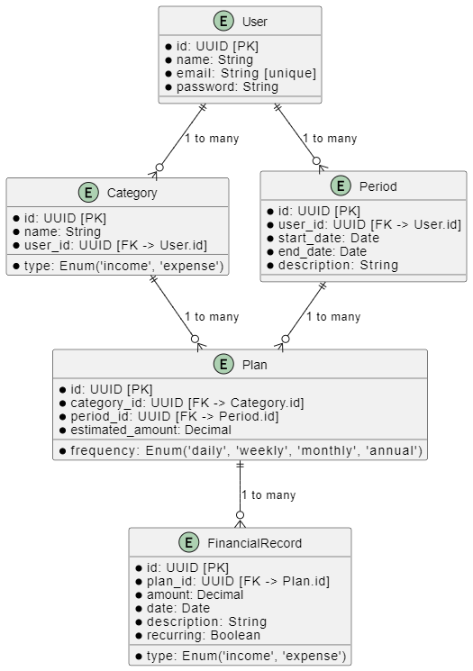

# finanzas-personales

## Project setup
```
npm install
```

### Compiles and hot-reloads for development
```
npm run serve
```

### Compiles and minifies for production
```
npm run build
```

### Customize configuration
See [Configuration Reference](https://cli.vuejs.org/config/).

## Requirements
- The system must allow users to record a plan for incomes and expenses over defined periods (monthly by default, daily, weekly, and yearly).
- Planning must be done before the start of each period, but it should be editable at any time.
- Users must be able to record their incomes and expenses with the option to categorize them.
- The system must include predefined income and expense categories (e.g., food, transportation, entertainment, rent, utilities).
- Users must be able to create their own custom categories for incomes and expenses.
- Both incomes and expenses should be able to be classified as recurring (with a specific periodicity) or extraordinary (non-recurring).
- Users must be able to view the status of their expenses compared to what was planned, with the ability to filter by expense type.

*Could Have in the future*:
- The system should be accessible from web browsers on both desktop and mobile devices.
- Each user should have a personal account and should only be able to view their own data.
- The system could provide notifications or alerts when the budget for a specific category is exceeded.

## Data Model



- **User**: Stores basic user information, including name, email, and encrypted password.
- **Category**: Defines income and expense categories, with a direct relationship to the user who created them. Each category can be associated with multiple plans.
- **Period**: Represents a specific time period associated with a user, including start and end dates, along with an optional description.
- **Plan**: Associates a category and a specific period, defining the frequency (daily, weekly, monthly, annual) along with an estimated amount for the plan.
- **FinancialRecord**: Stores actual income and expenses linked to a specific plan, allowing classification as recurring or extraordinary.

### Customize configuration
See [Configuration Reference](https://cli.vuejs.org/config/).
